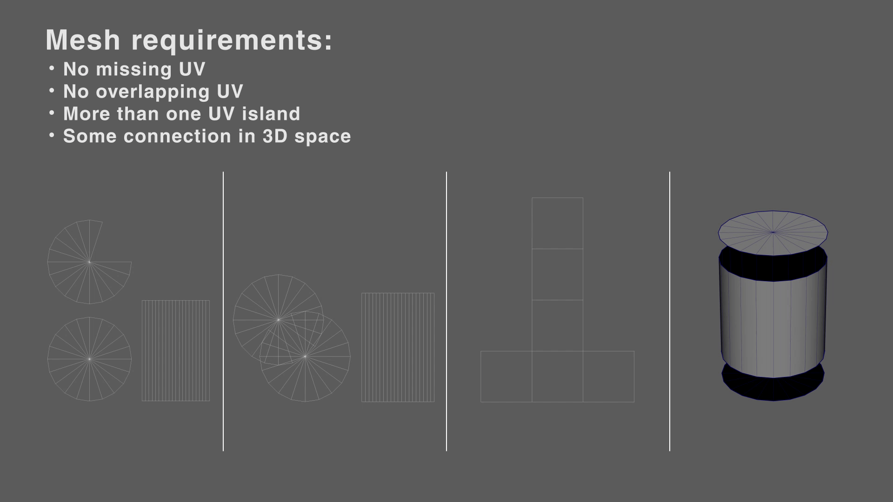
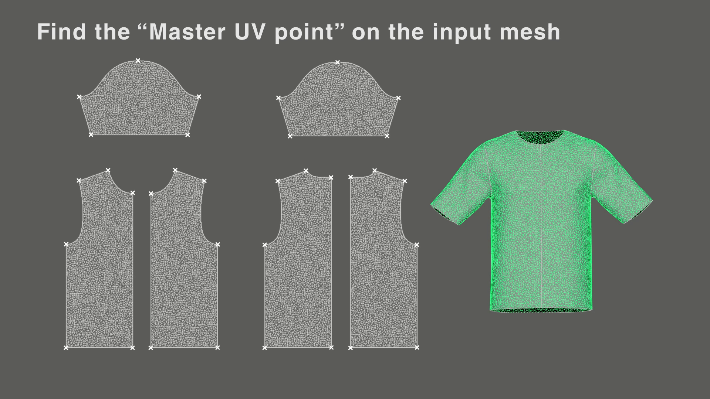
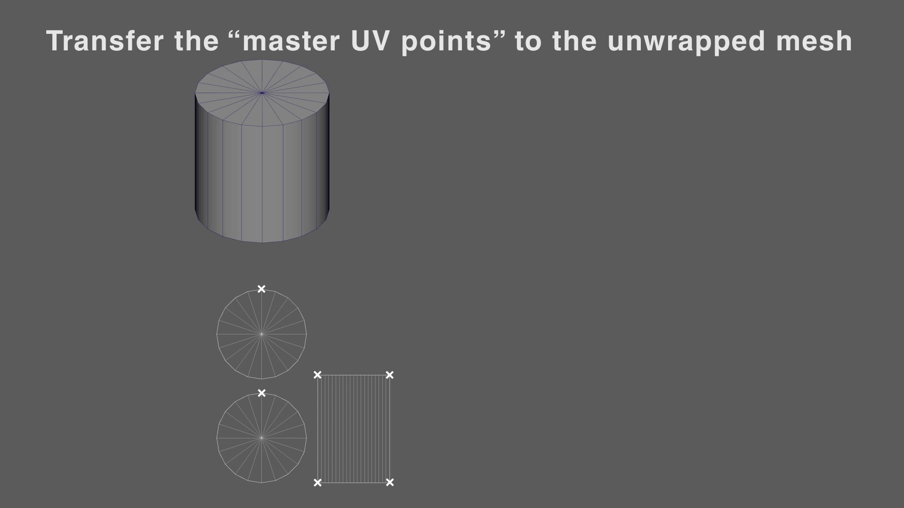
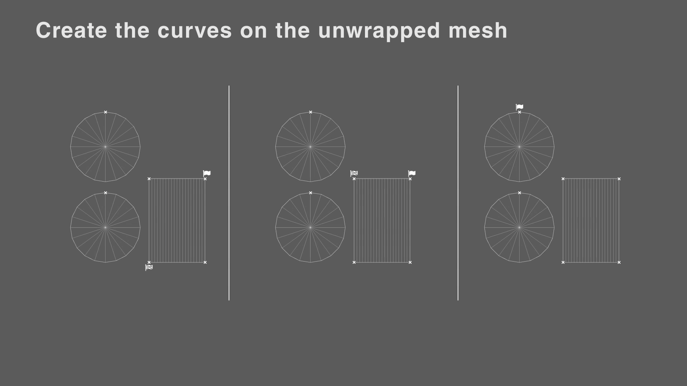
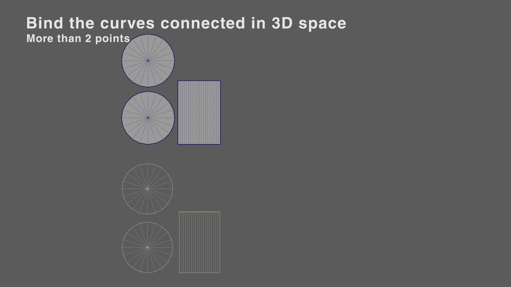

# Garment retopo script for Maya

# Why this script exist?

The purpose of this script is to facilitate the retopology of garments by providing visual feedback and an efficient integration of Zremesh.

# How this script works?

## The Unwrap analyze button:

Let's start by analyzing what happen when the user click on the "Unwrap analyze" button.

From an input garment mesh and the script will:

- Unwrap the mesh.

- Create curves along the perimeter of the UV islands.

- For each curve create an interactive edge coulter.

- Assign the same color to a pair of curves connected together.

This is the list of operation in order:

1. Check if the mesh selected by the user is valid. It must have the following characteristics:
   
   - Every vertex must have at least one UV point.
   
   - At least two UV shells islands.
   
   - No overlapping UVs.
   
   - The number of UV needs to be higher that the number of vertexes. This is the same as saying that the UV islands need to connected in 3D space.

2. Look for what I will refer as the name on "UV master point". You can notice that their disposition is far from casual, we can these for creating the curve on the perimeter. You are sure that these point will live of the border of the mesh so every points will always have 2 neighbour.
   You can define a "UV master point" when at least one of the two condition is true:
   
   - the UV point has 3 or more UV connected to the vertex.
   
   - one of the two neighbour have less UV point.

3. Do the mesh unwrapping:
   
   - Detach all the vertexes that live on the UV border. When done every vertex will have exactly one UV point.
   
   - Move in 3d space every vertex based on its UV coordinate. The UV are a 2d representation so just use 0 as the 3 axis.
   
   - Move and scale the unwrapped mesh properly based on the bounding box of the input mesh.

4. Now you need get the "Master UV point" on the unwrapped mesh instead:
   
   - For every "Master UV point" found before on the input mesh, get the 2d coordinate of it. Find the closest UV point to that coordinate on the unwrapped mesh.

5- Now you can create the curve on the perimeter of the unwrapped mesh:

- If there is only one "Master UV point" on a UV island.
  
  - just create a curve based on the entire edge perimeter.

- if there are more than one:
  
  - For each possible combination of two "Master UV point" assign a starting point and a end point.
  
  - Create a curve when the start point and the end point are connected without any other "obstacles" on the way.

6- Now as a last step you can assign the color to each curve:

- if the curve has only 2 point:
  
  - For each open curve get the two UV points that are closest to the extremists.
  
  - Find the equivalent UV points on the posed mesh.
  
  - Find all the UV points associated with UV points just found minus themself.
  
  - For each open curve:
    
    - check in the list of those UV points for two UV points that match with the extremities of another curve. If found retrieve the curve and do the pairing with the starting one.

- if curve has more than 2 point:
  
  - get the closest UV point to a random inner point of the curve.
  
  - Find the equivalent UV point on the posed mesh. You will get a vertex that can have one or two UV points.
  
  - If that the vertex has two UV points that means that you can use the new one for finding the pair:
    
    - Find the equivalent UV point to the newly founded one on the unwrapped mesh.
    - Find the closest curve to that point on the unwrapped mesh.
    - Pair the curve found with the starting one.

## Relax garment

Pressing the "Relax flat mesh" button will:

- Redistribute uniformly the vertexes on the border.
- Relax the inner vertexes.
- If the unwrapped version of the garment is available:
  - Transfer the UVs based on that mesh.
- If the unwrapped version of the garment is not available:
  - Redistribute uniformly the UVs on the border.
  - Relax the inner UVs.

## Density control

If you enable the function "Use polypaint" you can control the density of the result by painting vertex colors.

