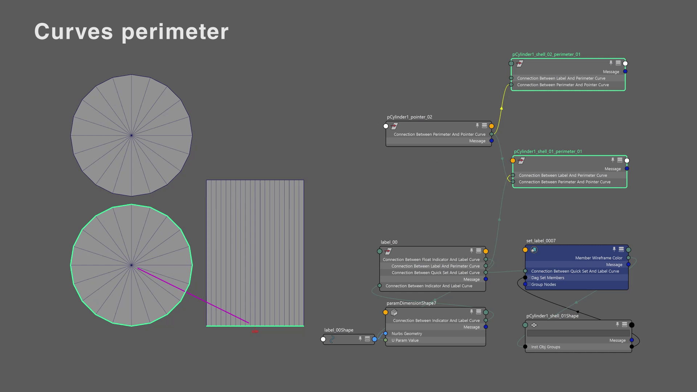
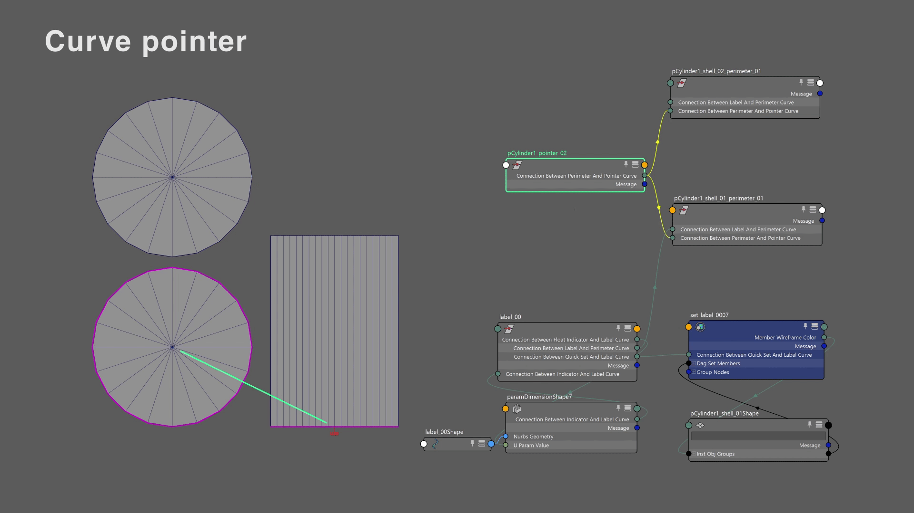
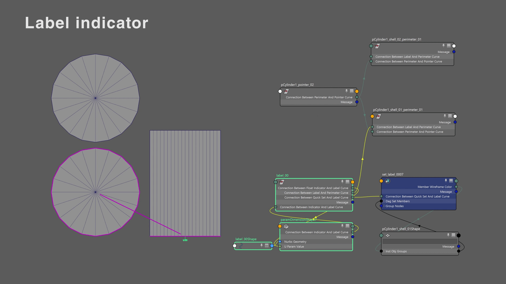
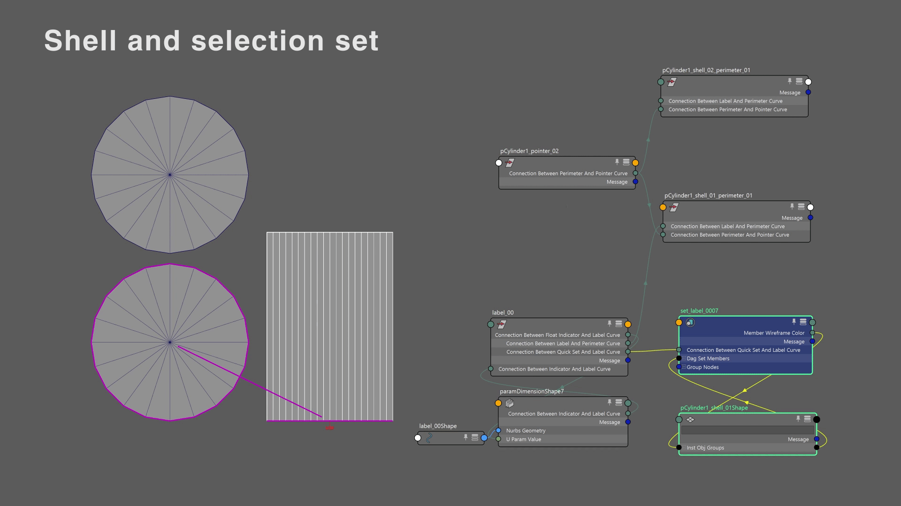

# Node Connections

This code uses connections between nodes to avoid storing variables in python. This allows the program to work properly in different sessions.

This is the list of all the connections:

### The perimeter curve

Has this values:

- `connection_between_label_and_perimeter_curve`
  
  - Output the transform node of a label

- `connection_between_perimeter_and_pointer_curve`
  
  - If the curve is pairable:
    
    - Output the transform node of the pointer curve
  
  - Else:
    
    - Output None

### The pointer curve

- `connection_between_perimeter_and_pointer_curve`
  
  - Output the transform node of the two perimeter curves

### The label indicator

- `connection_between_label_and_perimeter_curve`
  - Output the transform node of a perimeter curve
- `connection_between_quick_set_and_label_curve`
  - Output the selection set of an edge
- `connection_between_indicator_and_label_curve`
  - Output the paramDimension node
- `connection_between_float_indicator_and_label_curve`
  - Define the number displayed on the label indicator

### The selection set

- It's always associated to an edge selection that live on the shell border

