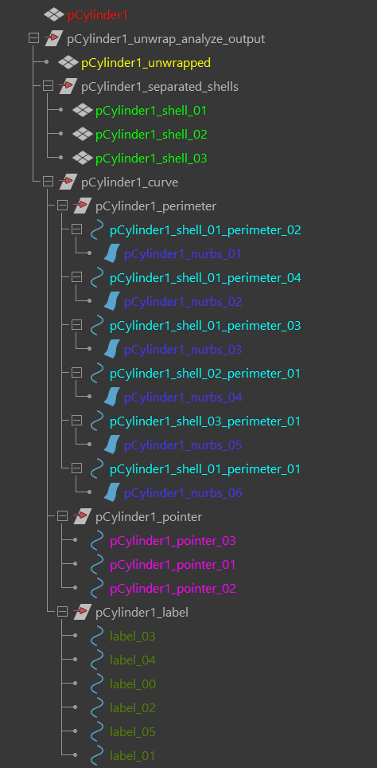

# The outliner structure

Let's analyze the structure produced by the "Unwrap and analyze" command on a cylinder.

### The input mesh

This is the input mesh selected by the user. Will became hidden after the process.

Just as a remainder, it must follow these requirements:

- Every vertex must have at least one UV point.

- At least two UV shells islands.

- No overlapping UVs.

- The number of UV needs to be higher that the number of vertexes. This is the same as saying that the UV islands need to connected in 3D space.

### The unwrapped mesh

The unwrapped version of the input mesh. It shares the same UV coordinate as the parent but it is flat on the z axis.

It is just used to figure out which UV point a vertex is associated with and vice-versa. It is hidden.

### The separated shells

These are the separated shells of the unwrapped version. These are only component that the user is meant to interact with directly. You could even create a mesh with the same position and size and use the button "Rebind labels" to use the newly created one in the retopology.

### The perimeter curves

The curves that live the shells perimeter. They can be paired or unpaired depending on the geometry. If unpaired will be always be black in color. They cannot be selected while the UI is open. If you hover over with the mouse the pointer curve (if present) will be shown.

### The nurbs curves

They are used for triggering the `cmds.hitTest()` command when the user hover over with the mouse. They are not visible. 

### The pointer curves

The pointer curve that remain hidden most of the time. They cannot be selected while the UI is open.

### The label indicators

These are `paramDimension` nodes that are used as a labels. They cannot be selected while the UI is open and by default are hidden.
