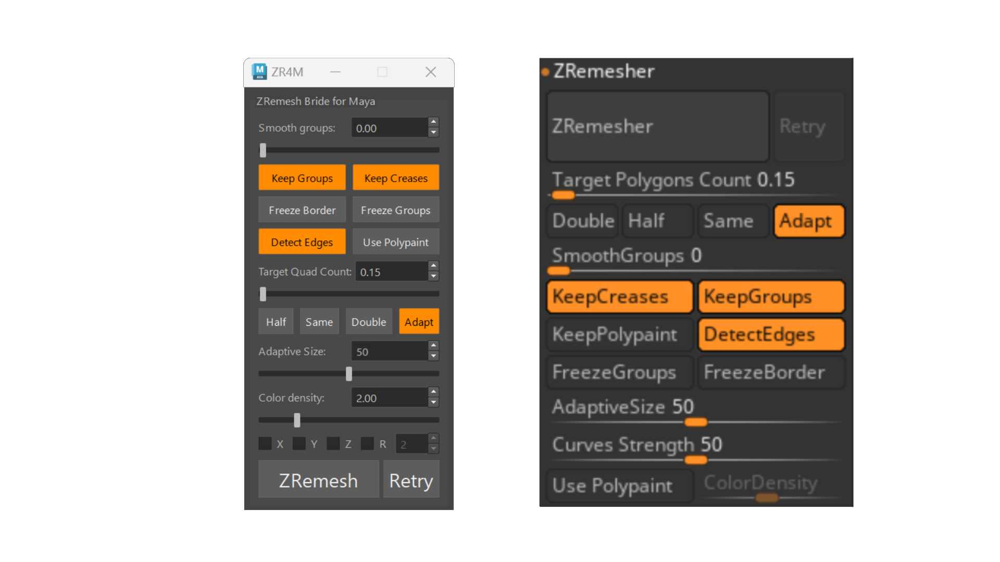

# How the zremesh works inside Maya

The upper part of the UI is for the remesher and the other is specific for garments.



When the zremesh button is pressed, Maya does the following steps:

- Write a .txt file written in zscript containing the settings for the zremesh called `tmp_zremesh_settings.txt`.
- Export the mesh to .ma or .GoZ (depends if the GoZ plugin is installed or not).
- Launch `start_zbrush_bridge.zsc` that compile and execute the just written`tmp_zremesh_settings.txt` file.
- Zbrush do the zremesh and export the result in addition to dummy mesh.
- In the meantime, Maya is waiting for the dummy mesh to be created.
- When done, Maya will import the zremesh output mesh.
- For each polygroup, a material with a random color will be created. 

# How `start_zbrush_bridge.zsc` is created

The file `start_zbrush_bridge.zsc` responsible for executing the zremesh with the user chosen setting is created with this code:

```zscript
[If,1,
[VarDef, start_zbrush_bridge, "*absolute path*\tmp_zremesh_settings.txt"]
[FileNameSetNext, start_zbrush_bridge]
[IPress,Zscript:Load]
]
```

Zbrush will compile this input script into a .zsc file. This file will execute the zscript instructions from `tmp_zremesh_settings.txt` whenever you run it.

## File format compatibility table

The table below summarizes the different file formats that can be used for exporting and importing data between Maya and Zbrush, and their pros and cons.

| file | crease | polypaint | polygroup | works with Zscript | Maya importable | requires plugin |
| ---- | ------ | --------- | --------- | ------------------ | --------------- | --------------- |
| .ma  | yes    | no        | no        | yes                | no              | no              |
| .obj | no     | no        | yes       | yes                | yes             | no              |
| .fbx | yes    | yes       | yes       | no                 | yes             | no              |
| .ply | no     | yes       | no        | yes                | no              | no              |
| .goz | yes    | yes       | yes       | yes                | yes             | yes             |

## .ma

The .ma appears to be unreadable to Maya when exporting from Zbrush but supports the crease data when importing in Zbrush. Unfortunately, it does not support the polygroup and vertex color.

## .obj

The .obj supports the polygroup in both ways (if enabled in the settings) but not the crease.

## .fbx

The .fbx supports the polygroup in both ways and the crease but does not work with zscript.

## .ply

Zbrush can import .ply data and read color vertex data. It does not support polygroup and creases. Maya cannot import .ply data

## .goz

The .goz supports everything but requires the plugin. Pixologic must update it for each Maya version. Just as a note: GoB for Blender writes the binary .GoZ without it but is slower and potentially unstable because of the reverse engineering.

## Current setup

If GoZ is not installed will fall back to .ma and .obj. The only limitation
is that you cannot transfer polypaint information to Zbrush

- If the goz plugin is installed then:
  
  - Maya will export the mesh in .GoZ file format. Every data will be maintained (crease, polygroup and vertex color)
  - Zbrush will import the .GoZ from Maya and export the output result again as a .GoZ
  - Finally Maya will import the output from Zbrush

- Else if not found then:
  
  - Maya will export the mesh in .ma file format.
    
    - If there is more than one material assign to the mesh an individual UV shell will be created for each.
  
  - Zbrush will import the .ma with creasing infomation and export the output in .Obj
    
    - If there is more than one material assign to the mesh Zbrush will assign polygroups based on UV shell data. 
  
  - Finally Maya will import the output into the scene 

## Potential steps for avoiding .goz

The use of .GoZ could be avoided by using this workflow at the price of requiring a couple more step:

- Maya will export the mesh in .ply (maintaining color data) and again in .ma (maintaining crease and polygroup data)

- Zbrush will import both file and project the color data onto the .ma with the creasing. Then export the result in .obj

- Finally Maya will import the output into the scene

## The requirements for handling Zremesh

- Requires Zbrush running in the background. You should not sculpt in Zbrush while using this.
  If for some reason you need to do so, it should be possible to use one version of Zbrush only for the zremesh and the other one could be used for sculpting.

- The user must compile the .txt into .zsc the very first time that he wants to zremesh in Maya.
